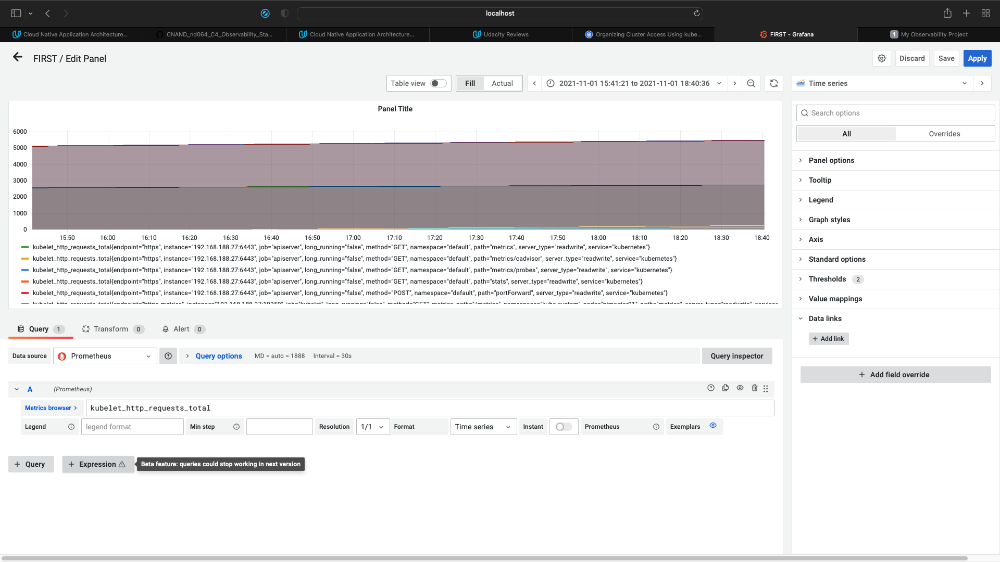

**Note:** For the screenshots, you can store all of your answer images in the `answer-img` directory.

## Verify the monitoring installation

## Setup the Jaeger and Prometheus source

## Create a Basic Dashboard

## Describe SLO/SLI
SLI is a quantitive measureable metric of the service level that tells about the actual performance compared to the defined SLO. For this context:
Monthly Uptime SLO can be achieved by measuring the Uptime over the month, and maintain the total uptime ratio as the SLO indicates. However, what is measured here is the SLI. 
Request Response Time SLO can be achieved by measuring the precentage of requests that achieve a certain Request Response Time as defined in the SLO, and maintain that ratio to be below a certain level as the SLO indicates. The actual measured ration is the SLI.
SLO is the target value over a period of time of a service level that an SLI measures.

Basically, SLI <= SLO.

## Creating SLI metrics.
1. Total instance uptime in hours per month
2. Total instance downtime in hours per month
3. Number of requests with 20x return codes
4. Number of requests with 40x or 50x return codes
5. Request response time

## Create a Dashboard to measure our SLIs
*TODO:* Create a dashboard to measure the uptime of the frontend and backend services We will also want to measure to measure 40x and 50x errors. Create a dashboard that show these values over a 24 hour period and take a screenshot.

## Tracing our Flask App
*TODO:*  We will create a Jaeger span to measure the processes on the backend. Once you fill in the span, provide a screenshot of it here.

## Jaeger in Dashboards
*TODO:* Now that the trace is running, let's add the metric to our current Grafana dashboard. Once this is completed, provide a screenshot of it here.

## Report Error
*TODO:* Using the template below, write a trouble ticket for the developers, to explain the errors that you are seeing (400, 500, latency) and to let them know the file that is causing the issue.

TROUBLE TICKET

Name:

Date:

Subject:

Affected Area:

Severity:

Description:

## Creating SLIs and SLOs
*TODO:* We want to create an SLO guaranteeing that our application has a 99.95% uptime per month. Name three SLIs that you would use to measure the success of this SLO.

## Building KPIs for our plan
*TODO*: Now that we have our SLIs and SLOs, create KPIs to accurately measure these metrics. We will make a dashboard for this, but first write them down here.

## Final Dashboard
*TODO*: Create a Dashboard containing graphs that capture all the metrics of your KPIs and adequately representing your SLIs and SLOs. Include a screenshot of the dashboard here, and write a text description of what graphs are represented in the dashboard.  
